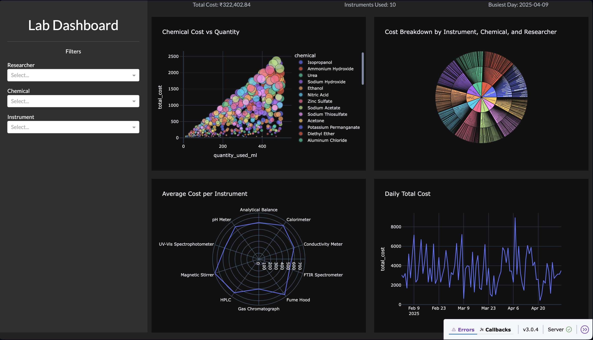

# Lab Management Dashboard

A modern, interactive dashboard for chemical laboratories to visualize and monitor chemical usage, cost trends, and instrument activity. Built using **Dash**, **Plotly**, and **SQLite**, this project combines analytical depth with a clean UI to support research insights and inventory decisions.

---

## Features

- **Chemical Usage Insights**: Bubble charts show quantity-cost correlations; polar plots highlight cost variance by instrument.
- **Hierarchical Cost Analysis**: Sunburst chart maps Instrument → Chemical → Researcher relationships.
- **Time-Series Tracking**: Daily cost trends rendered with responsive line graphs.
- **Filterable Interface**: Multi-select dropdowns for researcher, instrument, and chemical-based filtering.
- **KPI Highlights**: Quick-glance metrics for total cost, active instruments, and busiest day.

---

## Architecture

```plaintext
SQLite DB (lab_inventory.db)
   └── experiment_logs table
        • experiment_id
        • researcher
        • date
        • chemical
        • instrument_used
        • quantity_used_ml
        • cost_per_ml
        • total_cost

Backend: Python
  • pandas for data wrangling
  • sqlite3 for querying local DB

Frontend: Dash + Plotly
  • Custom layouts using dash-bootstrap-components
  • Visuals using scatter, sunburst, polar, and line charts

```
## Preview


